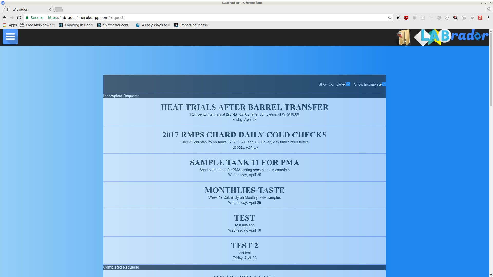
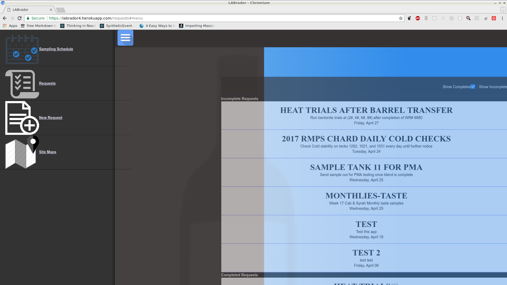
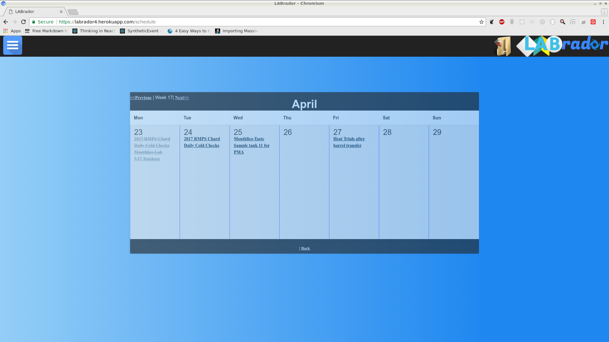
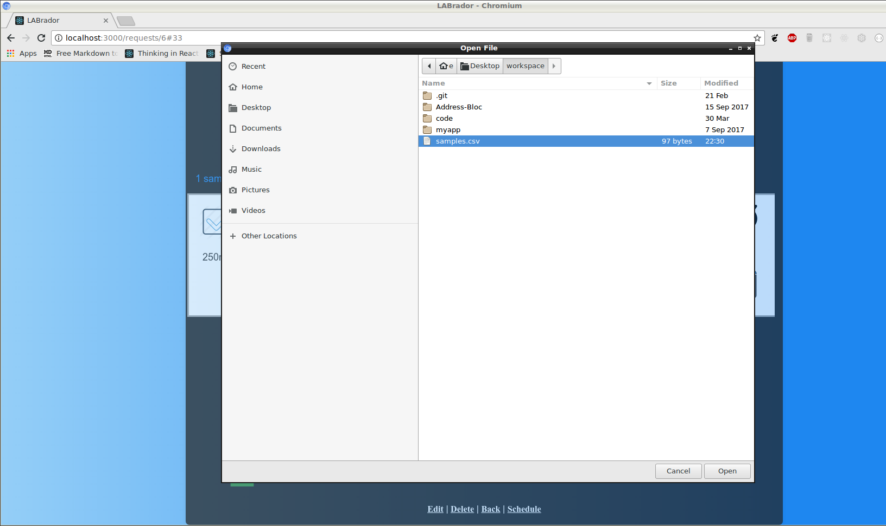
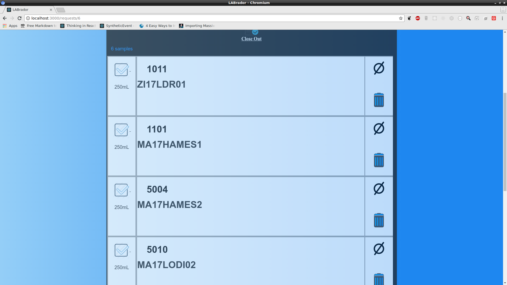

## LABrador

A Rails web application for tracking wine sample requests at the large-scale production winery where I am employed

	

	

	

		

clone and run locally:

<pre><code>$ git clone https://github.com/ERAlchemist/LABrador.git</pre></code>

<pre><code>$ cd LABrador</pre></code>

<pre><code>$ bundle install</pre></code>

<pre><code>$ rails s</pre></code>

Built as my cornerstone project for the [Bloc: Full-Stack Web Development Program](http://Bloc.io) 
